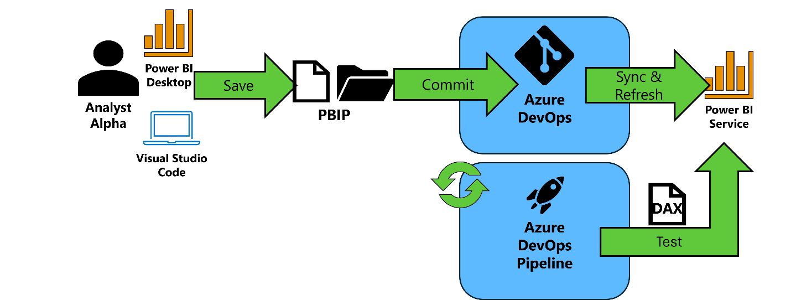

# Automating DAX Query View Testing Pattern with Azure DevOps

If you are using the [DAX Query View Testing Pattern](dax-query-view-testing-pattern.md) you can also look at automating the tests when a branch in your repository is updated and synced with a workspace through <a href="https://learn.microsoft.com/en-us/power-bi/developer/projects/projects-git" target="_blank">Git Integration</a>. The following instructions show you how to setup an Azure DevOps pipeline to automate testing.

***Note***: If you're interested in a demonstration of Git Integration and DAX Query View Testing Pattern, please check out my <a href="https://youtu.be/WyMQSyf3NvM?si=-W3TxyyJQXE0m-et" target="_blank">YouTube video</a> on the subject.

## Table of Contents
- [Automating DAX Query View Testing Pattern with Azure DevOps](#automating-dax-query-view-testing-pattern-with-azure-devops)
  - [Table of Contents](#table-of-contents)
  - [High-Level Process](#high-level-process)
  - [Prerequisites](#prerequisites)
  - [Instructions](#instructions)
    - [Create the Variable Group](#create-the-variable-group)
    - [Create the Pipeline](#create-the-pipeline)
    - [Running the Pipeline](#running-the-pipeline)
  - [Monitoring](#monitoring)

## High-Level Process

*Figure 1 -- High-level diagram of automated testing with PBIP, Git Integration, and DAX Query View Testing Pattern*

In the process depicted in **Figure 1**, your team **<u>saves</u>** their Power BI work in the PBIP extension format and **<u>commits</u>** those changes to Azure DevOps.

Then, you or your team **<u>sync</u>** with the workspace and **<u>refresh</u>** the semantic models. For this article, I am assuming either manual integration or the use of <a href="https://github.com/microsoft/Analysis-Services/tree/master/pbidevmode/fabricps-pbip" target="_blank">Rui Romano's code</a> to deploy a PBIP file to a workspace, with semantic models refreshed appropriately. With these criteria met, you can execute the tests.

## Prerequisites

1. You have an Azure DevOps project and have at least Project or Build Administrator rights for that project.

2. You have connected a premium-back capacity workspace to your repository in your Azure DevOps project. Instructions are provided <a href="https://learn.microsoft.com/en-us/power-bi/developer/projects/projects-git" target="_blank">at this link.</a>

3. Your Power BI tenant has <a href="https://learn.microsoft.com/en-us/power-bi/enterprise/service-premium-connect-tools#enable-xmla-read-write" target="_blank">XMLA Read/Write Enabled</a>.

4. You have a service principal or account (username and password) with a Premium Per User license. If you are using a service principal you will need to make sure the Power BI tenant allows <a href="https://learn.microsoft.com/en-us/power-bi/enterprise/service-premium-service-principal#enable-service-principals">service principals to use the Fabric APIs</a>. The service prinicipal or account will need at least the Member role to the workspace.

## Instructions

### Create the Variable Group

1. In your project, navigate to the Pipelines->Library section.

1. Select the "Add Variable Group" button.

3. Create a variable group called "TestingCredentials" and create the following variables:

- USERNAME_OR_CLIENTID - The service principal's application/client id or universal provider name for the account.
- PASSWORD_OR_CLIENTSECRET - The client secret or password for the service principal or account respectively.
- TENANT_ID - The Tenant GUID.  You can locate it by following the instructions <a href="https://learn.microsoft.com/en-us/sharepoint/find-your-office-365-tenant-id" target="_blank">at this link</a>.

1. Save the variable group.

### Create the Pipeline

1. Navigate to the pipeline interface.

2. Select the "New Pipeline" button.

3. Select the Azure Repos Git option.

4. Select the repository you have connected the workspace via Git Integration.

5. Copy the contents of the template YAML file located <a href="https://raw.githubusercontent.com/kerski/fabric-dataops-patterns/development/DAX%20Query%20View%20Testing%20Pattern/scripts/Run-DaxTests.yml" target="_blank">at this link</a> into the code editor.

6. Update the default workspace name for located on line 5 with the workspace you will typically use to conduct testing.

7. Select the 'Save and Run' button.

8. You will be prompted to commit to the main branch. Select the 'Save and Run' button.

9. You will be redirected to the first pipeline run, and you will be asked to authorize the pipeline to access the variable group created previously.  Select the 'View' button.

10. A pop-up window will appear. Select the 'Permit' button.

11. You will be asked to confirm.  Select the 'Permit' button.

12. This will kick off the automated testing.

13. Select the "Automated Testing Job".

14. You will see a log of DAX Queries that end in .Tests or .Test running against their respective semantic models in your workspace.

15. For any failed tests, this will be logged to the job, and the pipeline will also fail.

### Running the Pipeline

This pipeline has two parameters that can be updated at run-time.  The purpose is for you to be able to control which workspace to conduct the testing and the specific data models to conduct testing.  When running this pipeline you will be prompted to provide the following:

1) Workspace name - This is a required field that is the name of the workspace.  Please note the service principal or account used in the variable group needs the Member role to the workspace.
2) Dataset/Semantic Model IDs - The second question is an optional field if you would like to specify which dataset to conduct testing.  More that one dataset can be identified by delimiting with a comma (e.g. 23828487-9191-4109-8d3a-08b7817b9a44,12345958-1891-4109-8d3c-28a7717b9a45).  If no value is passed, the pipeline will conduct the following steps:
   1) Identify all the semantic models in the repository.
   2) Verify each semantic model exists in the workspace.
   3) For the semantic model that exist in the workspace, check if any ".Test" or ".Tests" DAX files exist.
   4) Execute the tests and output the results.

***Note***: This pipeline, as currently configured, will run every 6 hours and on commit/syncs to the main, test, and development branches of your repository.  Please update the triggers to fit your needs as appropriate. For more information, please see <a href="https://learn.microsoft.com/en-us/azure/devops/pipelines/process/pipeline-triggers?view=azure-devops" target="_blank">this article</a>.

## Monitoring

It's essential to monitor the Azure DevOps pipeline for any failures. I've also written about some best practices for setting that up <a href="https://www.kerski.tech/bringing-dataops-to-power-bi-part31/" target="_blank">in this article</a>.

*Git Logo provided by [Git - Logo Downloads
(git-scm.com)](https://git-scm.com/downloads/logos)*