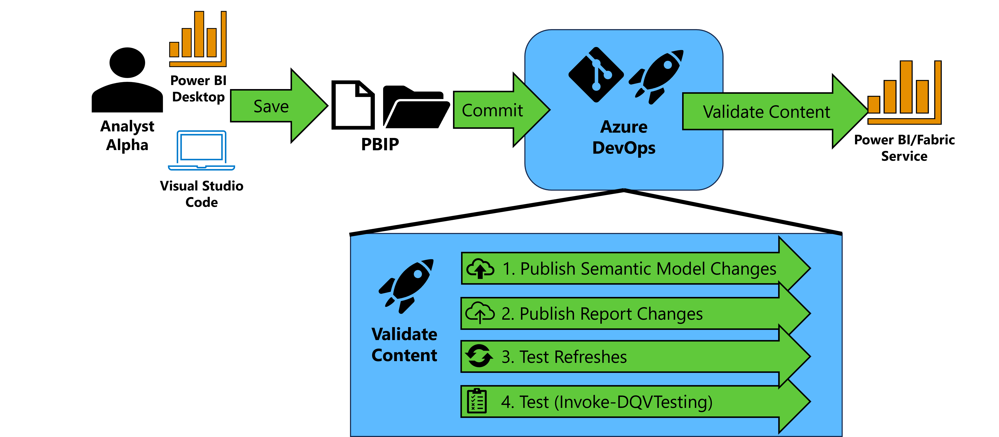

# PBIP Deployment & DAX Query View Testing (DQV) Pattern

If you are using the [DAX Query View Testing Pattern](dax-query-view-testing-pattern.md) you can also look at automating the deployment and testing using Azure DevOps. The following instructions show you how to setup an Azure DevOps pipeline to automate deployment of Power BI reports/semantic models and automate testing. 

## Table of Contents
- [PBIP Deployment \& DAX Query View Testing (DQV) Pattern](#pbip-deployment--dax-query-view-testing-dqv-pattern)
  - [Table of Contents](#table-of-contents)
  - [High-Level Process](#high-level-process)
  - [Prerequisites](#prerequisites)
  - [Instructions](#instructions)
    - [Create the Variable Group](#create-the-variable-group)
    - [Create the Pipeline](#create-the-pipeline)
  - [Monitoring](#monitoring)
  - [Powershell Modules](#powershell-modules)

## High-Level Process

*Figure 1 -- High-level diagram of automated deployment of PBIP and automated testing with the DAX Query View Testing Pattern*

In the pattern depicted in Figure 1, your team saves their Power BI work in the PBIP extension format and commits those changes to Azure DevOps.

Then an Azure Pipeline is triggered to validate the content of your Power BI semantic models and reports by performing the following:

1.  The semantic model changes are identified using the "git diff" command. Semantic models that are changed are published to a premium-backed workspace using <a href="https://github.com/microsoft/Analysis-Services/tree/master/pbidevmode/fabricps-pbip" target="_blank">Rui Romano\'s Fabric-PBIP script</a>. The question now is, which workspace do you deploy it to? I typically promote to a ***Build*** workspace first, which provides an area to validate the content of the semantic model before promoting to a ***development*** workspace that is shared by others on the team. This reduces the chances that a team member introduces an error in the ***Development*** workspace that could hinder the work being done by others in that workspace.

2.  With the semantic models published to a workspace, the report changes are identified using the "git diff" command. Report changes are evaluated for their "definition.pbir" configuration. If the byConnection property is null (meaning the report is not a thin report), the script identifies the local semantic model (example in Figure 2). If the byConnection is not null, we assume the report is a thin report and configured appropriately. Each report that has been updated is then published in the same workspace.

    
    *Figure 2 - Example of. pbir definition file*

3.  For the semantic models published in step 1, the script then <a href="https://learn.microsoft.com/en-us/power-bi/guidance/powerbi-implementation-planning-content-lifecycle-management-validate" target="_blank">validates the functionality</a> of the semantic model through a synchronous refresh using <a href="https://www.powershellgallery.com/packages/Invoke-SemanticModelRefresh/0.0.2" target="_blank">Invoke-SemanticModelRefresh</a>. Using the native <a href="https://learn.microsoft.com/en-us/rest/api/power-bi/datasets/refresh-dataset" target="_blank">v1.0 API</a> would be problematic because it is asynchronous, meaning if you issue a refresh you only know that the semantic model refresh has kicked off, but not if it was successful. To make it synchronous, I've written a module that will issue an enhanced refresh request to get a request identifier (a <a href="https://en.wikipedia.org/wiki/Universally_unique_identifier" target="_blank">GUID</a>). This request identifier can then be passed as parameter to the <a href="https://learn.microsoft.com/en-us/rest/api/power-bi/datasets/get-refresh-execution-details" target="_blank">Get Refresh Execution Details</a> endpoint to check on that specific request's status and find out whether or not the refresh has completed successfully.
      
    If the refresh is successful, we move to step 4. Note: The first time a new semantic is placed in the workspace, the refresh will fail. You have to "prime" the pipeline and set the data source credentials manually. As of April 2024, this is not fully automatable and the Fabric team at Microsoft <a href="https://powerbi.microsoft.com/en-us/blog/using-xmla-endpoints-to-change-data-sources-in-a-power-bi-dataset/" target="_blank">has written about</a>.

4.  For each semantic model, Invoke-DQVTesting is called to run the DAX Queries that follow the DAX Query View Testing Pattern. Results are then logged to the Azure DevOps pipeline (Figure 3). Any failed test will fail the pipeline.

*Figure 3 - Example of test results logged by Invoke-DQVTesting*

## Prerequisites

1. You have an Azure DevOps project and have at least Project or Build Administrator rights for that project.

2. You have connected a premium-back capacity workspace to your repository in your Azure DevOps project. Instructions are provided <a href="https://learn.microsoft.com/en-us/power-bi/developer/projects/projects-git" target="_blank">at this link.</a>

3. Your Power BI tenant has <a href="https://learn.microsoft.com/en-us/power-bi/enterprise/service-premium-connect-tools#enable-xmla-read-write" target="_blank">XMLA Read/Write Enabled</a>.

4. You have a service principal or account (username and password) with a Premium Per User license. If you are using a service principal you will need to make sure the Power BI tenant allows <a href="https://learn.microsoft.com/en-us/power-bi/enterprise/service-premium-service-principal#enable-service-principals">service principals to use the Fabric APIs</a>. The service principal or account will need at least the Member role to the workspace.

## Instructions

### Create the Variable Group

1. In your project, navigate to the Pipelines->Library section.

1. Select the "Add Variable Group" button.

3. Create a variable group called "TestingCredentials" and create the following variables:

- USERNAME_OR_CLIENTID - The service principal's application/client id or universal provider name for the account.
- PASSWORD_OR_CLIENTSECRET - The client secret or password for the service principal or account respectively.
- TENANT_ID - The Tenant GUID.  You can locate it by following the instructions <a href="https://learn.microsoft.com/en-us/sharepoint/find-your-office-365-tenant-id" target="_blank">at this link</a>.

1. Save the variable group.

### Create the Pipeline

1. Navigate to the pipeline interface.

2. Select the "New Pipeline" button.

3. Select the Azure Repos Git option.

4. Select the repository you have connected the workspace via Git Integration.

5. Copy the contents of the template YAML file located <a href="https://raw.githubusercontent.com/kerski/fabric-dataops-patterns/main/DAX%20Query%20View%20Testing%20Pattern/scripts/Run-CICD.yml" target="_blank">at this link</a> into the code editor.

6. Update the default workspace name for located on line 5 with the workspace you will typically use to conduct testing.

7. Select the 'Save and Run' button.

8. You will be prompted to commit to the main branch. Select the 'Save and Run' button.

9. You will be redirected to the first pipeline run, and you will be asked to authorize the pipeline to access the variable group created previously.  Select the 'View' button.

10. A pop-up window will appear. Select the 'Permit' button.

11. You will be asked to confirm.  Select the 'Permit' button.

12. This will kick off the automated deployment and testing as [described above](#high-level-process).

13. Select the "Automated Deployment and Testing Job".

14. You will see a log of DAX Queries that end in .Tests or .Test running against their respective semantic models in your workspace.

15. For any failed tests, this will be logged to the job, and the pipeline will also fail.

## Monitoring

It's essential to monitor the Azure DevOps pipeline for any failures. I've also written about some best practices for setting that up <a href="https://www.kerski.tech/bringing-dataops-to-power-bi-part31/" target="_blank">in this article</a>.

## Powershell Modules

The pipeline leverages two PowerShell modules called Invoke-DQVTesting and Invoke-SemanticModelRefresh.  For more information, please see [Invoke-DQVTesting](invoke-dqvtesting.md) and [Invoke-SemanticModelRefresh](invoke-semanticmodelrefresh.md) respectively.

*Git Logo provided by [Git - Logo Downloads
(git-scm.com)](https://git-scm.com/downloads/logos)*
