# Gen2, Notebook Automated Testing Pattern

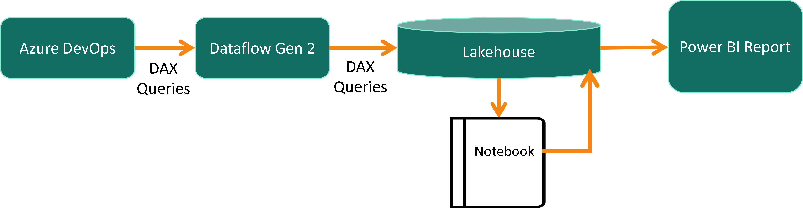

This pattern extracts DAX Query Views tests in the pbip format using a Gen2 Dataflow, run the tests in a Notebook, and stores the results in a Lakehouse.

## Table of Contents
1. [Prerequisites](#prerequisites)
1. [Steps](#steps)

## Prerequisites

### Azure DevOps
-  Signed up for <a href="https://docs.microsoft.com/en-us/azure/devops/user-guide/sign-up-invite-teammates?view=azure-devops" target="_blank">Azure DevOps</a> and have a project created.

- For Azure DevOps you must be a member of the Project Collection Administrators group, the Organization Owner, or have the Create new projects permission set to Allow. 

### Fabric Workspace

 - You must have a <a href="https://learn.microsoft.com/en-us/fabric/get-started/workspaces" target="_blank">workspace in Fabric</a>.
 - Copy the Workspace ID to Notepad for use later.  In your browser it should be the first GUID after the "groups" text:

 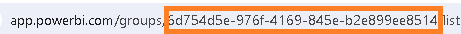

 - You have a workspace with a semantic model already synced and the data refreshed. You can use <a href="https://github.com/kerski/fabric-dataops-patterns/tree/main/Semantic%20Model" target="_blank">this Sample Model</a> for testing your setup.

### Visual Studio Code

- You must have <a href="https://code.visualstudio.com/download" target="_blank">Visual Studio Code</a> installed on your local machine.

### Steps

#### Setup DevOps
    
1. Create a Personal Access Token in Azure DevOps. Instructions can be found <a href="https://learn.microsoft.com/en-us/azure/devops/organizations/accounts/use-personal-access-tokens-to-authenticate?view=azure-devops&tabs=Windows#create-a-pat" target="_blank">at this link.</a> Copy it to your Notepad for later.  *Note: It is good to send a reminder in Outlook a week before the date the token expires.*
1. Copy the URL to the project in Azure DevOps to Notepad.  The format should be something like: ```https://dev.azure.com/{Organization Name}/{Project Name}```

#### Setup Fabric Workspace
1. Connect your AzureDevOps Repo to your Fabric workspace using the instructions <a href="https://learn.microsoft.com/en-us/fabric/cicd/git-integration/git-get-started?tabs=commit-to-git#connect-a-workspace-to-an-azure-repo" target="_blank">at this link.</a>      
1. In your Visual Studio Code project add the config file to <a href="https://github.com/kerski/fabric-dataops-patterns/blob/main/Azure%20DevOps/.pbixproj.json">your project</a> and replace the workspace property with the GUID you retrieved from in the Prerequisites section.

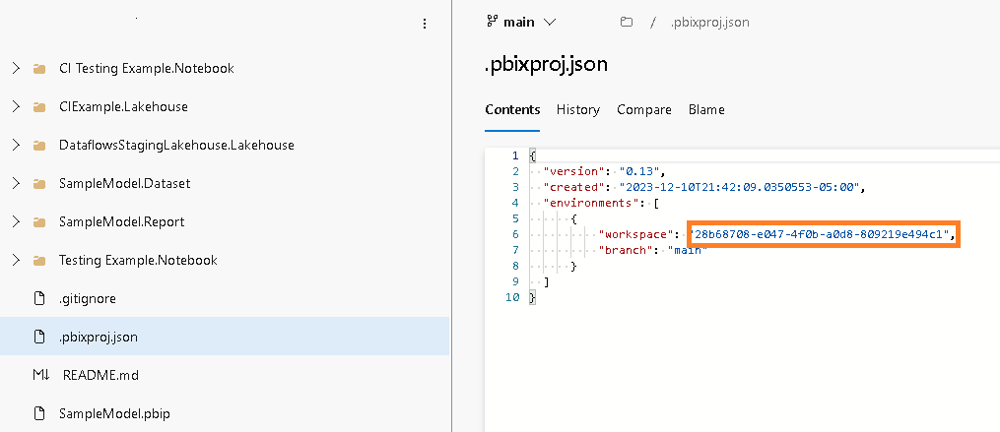

#### Setup Lakehouse

1. In your Fabric workspace, create a Lakehouse.  Instructions can be found <a href="https://learn.microsoft.com/en-us/fabric/onelake/create-lakehouse-onelake#create-a-lakehouse" target="_blank">at this link.</a>

#### Setup Dataflow Gen2

1. In the Fabric Workspace, create a Dataflow Gen2 dataflow using <a href="https://github.com/kerski/fabric-dataops-patterns/blob/main/Dataflow%20Gen2/API%20-%20Azure%20DevOps%20DAX%20Queries%20-%20Gen%202.pqt" target="_blank">this template.</a>
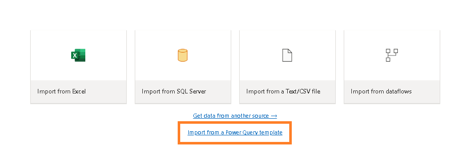
1. In the dataflow, update the AzureDevOpsBaseURL parameter with the URL you copied in the prior Azure DevOps step.
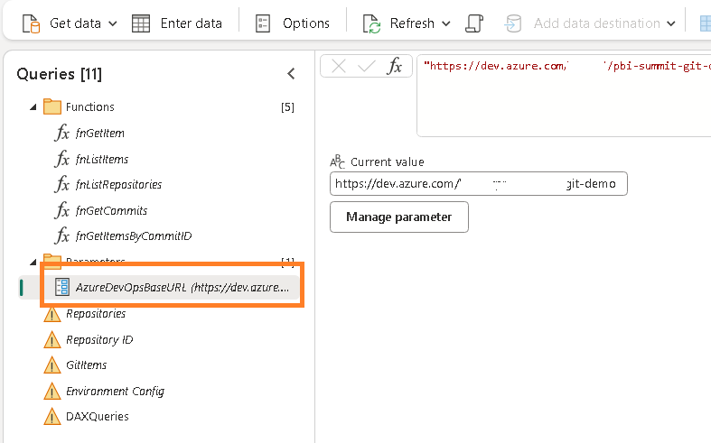
1. Click on the Respositories table and click on the "Configure Connection" button.
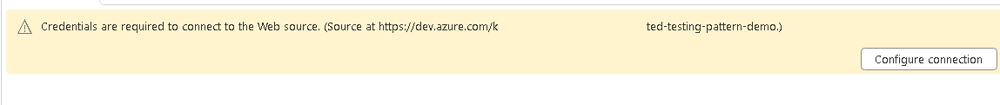
1. Using Basic Authentication, enter the Personal Access Token you copied in the prior Azure DevOps step into the Password field.  Leave the Username blank.
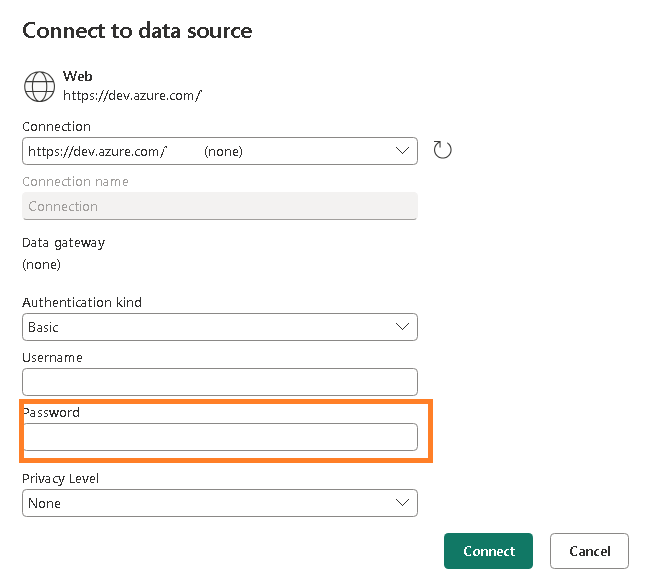
1. Click on the DAXQueries table and select plus sybmol above the "No data destination" message. Select the "Lakehouse" option.
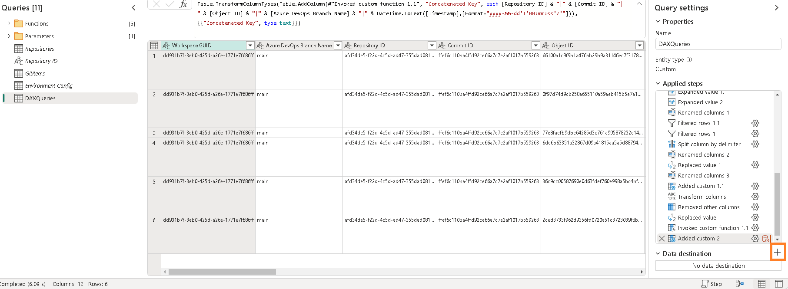
1. Connect to the Lakehouse you created in the workspace in the prior step. 
1. In the destination settings, choose the Fix Option and Save Settings.
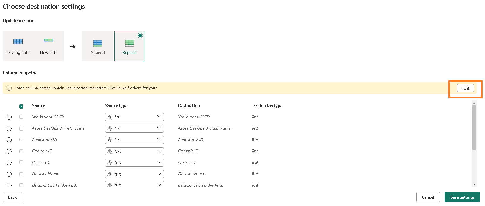
1. Publish the dataflow and verify it refreshes.

#### Setup Environment
1. Add an environment to your workspace by following the instructions <a href="https://learn.microsoft.com/en-us/fabric/data-engineering/create-and-use-environment" target="_blank">at this link.</a>
1. Add semantic-link to the environment and publish.
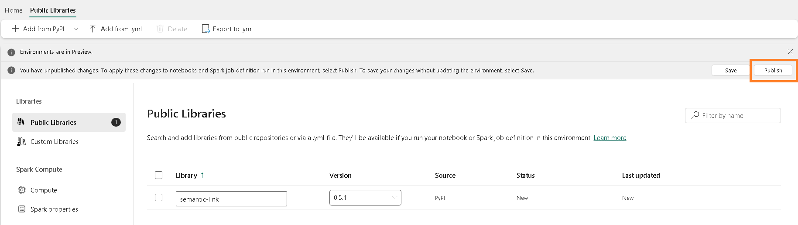

#### Setup Notebook
1. Create a notebook in your workspace using the instructions <a href="https://learn.microsoft.com/en-us/fabric/data-engineering/how-to-use-notebook" target="_blank">at this link.</a>
1. Update the name of the notebook and set the environment to the environment you created in the prior step.
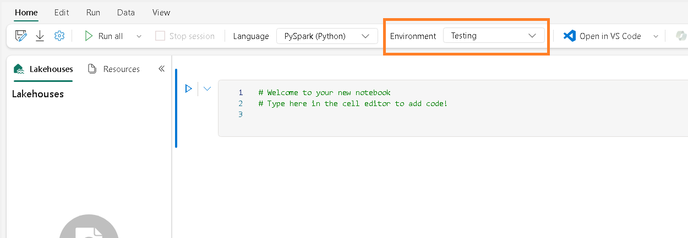
1. In the workspace, commit your changes back to Git.

1. Navigate to the Azure DevOps and locate the .py file in the subfolder where your Notebook was synced back to Azure DevOps.
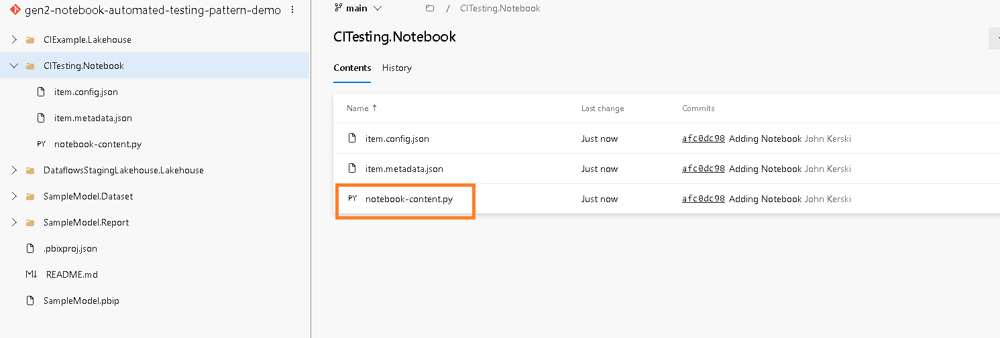
1. Edit the .py file in Azure DevOps and overwrite with the text <a href="https://github.com/kerski/fabric-dataops-patterns/blob/main/Notebook/Notebook%20Testing%20Example.py" target="_blank">from this template</a>. Commit those changes.
1. Navigate back to the Fabric Workspace and Update from Source Control.
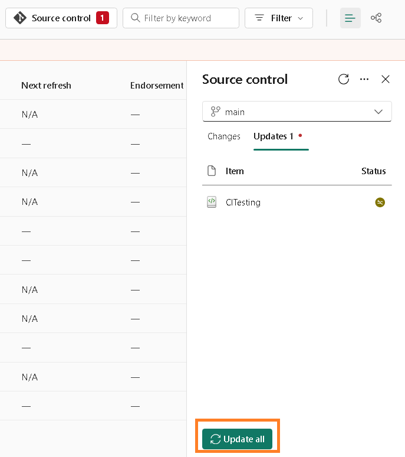
1. Open the Notebook and make sure to keep the new changes and verify the Environment and Lakehouse is connected correctly.
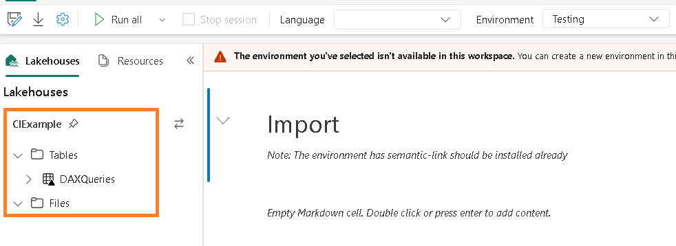
1. Verify the steps in the notebook all run correctly.
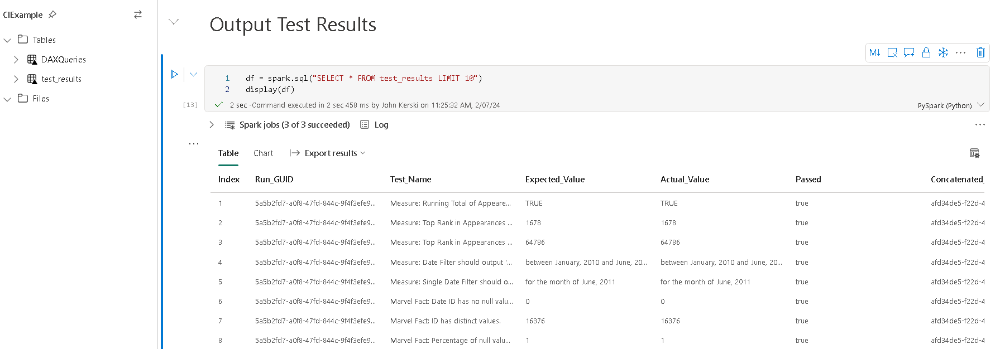

